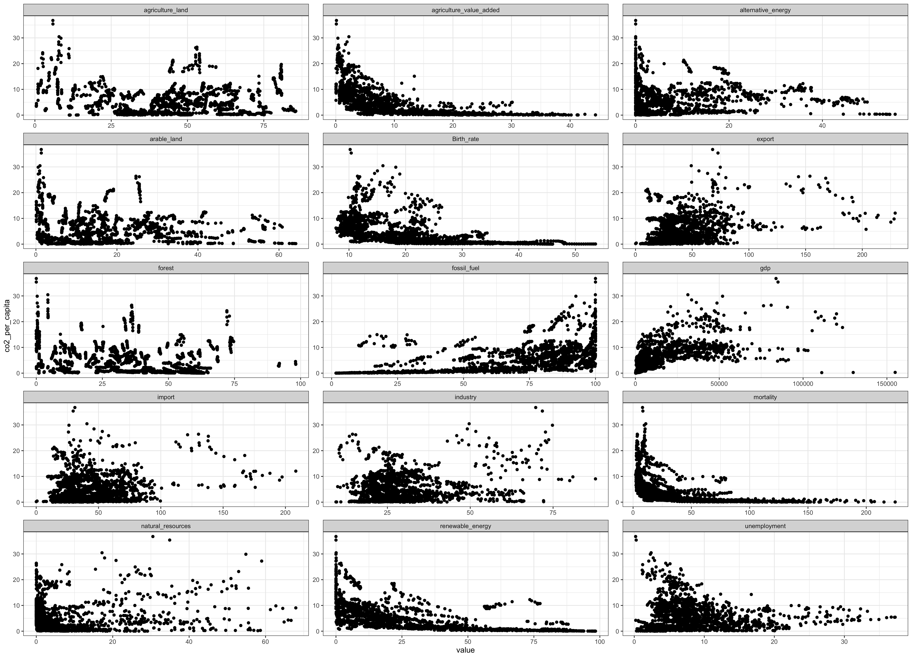
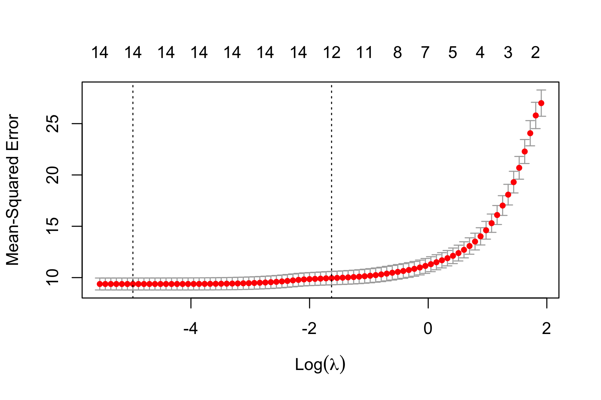

```{r setup, include=FALSE, message = FALSE}
options(scipen = 0, digits = 3)  # controls number of significant digits printed
library(tidyverse)
library(kableExtra)
```

\bigskip

The code to reproduce this report is available [on Github](https://github.com/cassied22/stat471_project).

\newpage

# Executive Summary

**Problem.** The discussion centered around global warming and climate change has triggered much attention in the past decade. It has been widely recognized that human activities, mainly burning fossil fuels, are the main source of the increasing the amount of carbon dioxide in my atmosphere, amplifying the natural greenhouse effect and result in the increase of temperature on earth. While there have been extensive ongoing and past research projects exploring the science embedding global warming and greenhouse effect, the analysis relating the different development indicators of a country to its carbon dioxide emission have not been studied comprehensively.  Therefore, this project is aiming at exploring the relationship between various development indicators and the carbon dioxide per capita for a country, from which we will be able to draw implications about the development status of a country and the potential contribution to the global warming and thus offering some advice to the future policy aiming for mitigating CO2 emissions. 

**Data.** The datasets used in this project are pulled from two sources: a time series dataset which includes annual carbon dioxide emissions using different measures (such as annual co2 per capita, total co2, co2 per gdp and so on ) at the country level from OurWorldInData, and data from WorldBank collecting information about various indicators measuring the development status of a country. I kept the data from all available countries dating 2000 or later since there are too many missing values in the earlier years.

From the list of indicators in WorldBank website, I chose 15 indicators spanning 4 major categories (Economy and Growth, Energy and Mining, Health and Environment) as explanatory variables. The response variable of interest is the annual CO2 emission per capita at the country-level. I used CO2 per capita instead of total CO2 emission to get rid of the population effect and all the indicators included are also independent of population.


**Analysis.** Before exploring my data or running any analyses, I split the data into a training dataset and a test dataset, with the test dataset reserved for assessing and comparing model performance. I then built 5 different models: ridge regression, LASSO regression, elastic net regression, random forest, and boosting. Of the regression models, ridge had the lowest test error (although the RMSE for the 3 regression models are very similar with the relative differences around $0.2%$) and of the tree-based models, the random forest model had the lowest test error (as well as the lowest test error overall).

**Conclusions.** From the results of the models, while some features are consistently being the strong predictors for both random forest and boosting, the relative importances for many other features vary across different models, leading to much uncertainties as to whether these features are appropriate predictors for CO2 emission per capita.  There are 3 features that are among the strongest predictors for the response variable with both boosting and random forest, and also selected by lasso and elastic net regression: they are GDP per capita (`gdp`), renewable energy consumption (`renewable_energy`) and agriculture value added (`agriculture_value_added`). While the result I got so far reveal only limited information about the relationship between development status of a country and CO2 emission, it indeed demonstrates that there are some indicators that are closely related to the emission of carbon dioxide, thus providing directions for further analysis and potential policy-making advice in the context of global warming. 


# Introduction

**Background.** Global warming is a serious issue affecting the future of the entire earth and human kind.  In the past years, we've already seen many observable effects of global climate change including shrinking glaciers and shifting of animal/plant ranges. Moreover, there are range of published evidence indicating that the net damage costs of climate change are likely to be significant and to increase over time, bringing serious threat to the future generation. Given the urgency, significance and the difficulty of tackling and mitigating the global warming, efforts from both individuals and governments are needed. Through various international agreements and protocols such as Paris Agreement, many countries have in fact set up ambitious plans to reduce carbon emissions. At the same time, states also need to consider the needs for social and economy development, which sometimes might ask for quite opposite actions. In order to better accomplish the goals, it is therefore useful to explore the relationship between various development indicators and carbon dioxide emission so that we could have a better understanding on how to balance the requirements of carbon footprint reduction and country development. 


**Analysis goals.** The goal of this project is to investigate the relationships between different development indicators and the CO2 emission at the country level. Specifically, I am interested in learning which factors are most relevant at predicting of the per capita carbon dioxide emission for a country.

**Significance.** I hope that this analysis will contribute to the growing research on climate change and greenhouse emissions by expanding our understanding of how different development indicators are correlated with the carbon dioxide emission so that we could give some implications about directions for future policy making targeting global warming. 

# Data

## Data sources

The dataset I used for analysis were merged data from two sources: a dataset includes annual carbon dioxide emission for different countries over the past decades and the 15 time series datasets featuring the 15 indicators of interest for different countries.

The datasets for the 15 explanatory variables come from WorldBank, which contains an extensive list of indicators measureing the development status of a country from many categories. I chose 15 indicators spanning 4 major categories (Economy and Growth, Energy and Mining, Health and Environment) and downloaded the relavent datasets. These datasets generally collect the indicator value for all countries spanning beginning from 1960 to 2020. However, there are many missing values depending on different indicators. ^[World Bank Indicators. (n.d.) https://data.worldbank.org/indicator]


The other dataset we drew from is the OurWorldInData CO2 emission dataset, which is sourced from the Global Carbon Project and releases a new update of CO2 emissions annually.^[OurWorldInData Github. (n.d.) https://github.com/owid/co2-data] This time series dataset includes data beginning from 1949.   

## Data cleaning

Our central task in the data cleaning stage of the project was to merge the data from the two sources described above. Both sources provided their respective data annually on the country level (classified as a 3-character iso/country code).
While the CO2 dataset has all emission per capita values in one column and `year` as another column, the indicator datasets have separate columns for each year.  Therefore, I first pivot-longer the indicators datasets so that they could match the style of the CO2 dataset. Then I merge them by country code and by year using inner join. I dropped the missing values from both datasets before merging and kept all the data points beginning from 2000 to 2020 since the older data were very sparse. 

## Data description

### Observations

Our dataset has a total of 1888 observations, corresponding to the different countries in different years included in our analysis.

### Response Variable

Our response variable is the annual CO2 emission per capita for each country in different years. I drew this variable directly from the raw CO2 dataset from OurWorldInData. I used CO2 emission per capita instead of total CO2 emission in order to exclude the impact of population. ^[OurWorldInData. (n.d.) https://ourworldindata.org/co2-emissions]

### Features

From WorldBank's list of development indicators, I included 15 explanatory variables in my analysis, which fall into four main categories: Economy and Growth, Energy and Mining, Health and Environment. For a detailed specification of these variables, refer to Appendix \@ref(appendix).

## Data allocation

I split the dataset into two subsets: a training dataset used for building our predictive models and a test dataset used for evaluating our models. I used all the observation earlier than 2012 as training set (which is approximately 78% of the total dataset) and the remaining observations as testing set. 

## Data exploration

### Response

I first sought to understand the response variable’s distribution. As seen in the histogram of CO2-per capita (Figure \@ref(fig:response-histogram)), the data appears to be right-skewed, with few observations exceeding a annual CO2 per capita of 30 tonnes. The summary statistics for the CO2-per capita distribution is shown in Table \@ref(tab:summary) . I proceeded to determine which country/year had extreme response variable by looking at the sorted data. The sorted data (Table \@ref(tab:top-20-observations)) shows that Qatar in 2014 has the highest CO2 per capita. 

```{r response-histogram, out.width = "80%", fig.cap = "Distribution of CO2 per capita; vertical dashed line indicates the median.", fig.align='center',  fig.pos = "H", echo = FALSE}
knitr::include_graphics("../results/response-histogram.png")
```

```{r summary, message = FALSE, echo = FALSE}
read_tsv("../results/co2_summary.tsv") %>%
  kable(format = "latex", row.names = NA, 
        booktabs = TRUE, digits = 2, 
        caption = "CO2 per capita summary statistics") %>%
  kable_styling(position = "center") %>%
  kable_styling(latex_options = "HOLD_position")
```
```{r top-20-observations, message = FALSE,  fig.pos = "H", echo = FALSE}
read_tsv("../results/top-20-co2-data.tsv") %>%
  kable(format = "latex", row.names = NA, 
        booktabs = TRUE, digits = 2, 
        caption = "Top 20 countries/years by CO2 per capita.") %>%
  kable_styling(position = "center") %>%
  kable_styling(latex_options = "HOLD_position")
```
I also determined distribution of mean CO2 per capita for each country(CO2 per capita averaged over different years for each country). The distribution of mean CO2 per capita are displayed in Figure \@ref(fig:top-10). This distribution is also right-skewed with a few countries having mean CO2 per capita over 20 tonnes.

```{r top-10, out.width = "80%", fig.cap = "Distribution of mean CO2 per capita", fig.pos = "H", fig.align = "center",echo = FALSE}

```

I also determined the top 20 countries with highest mean CO2 per capita, and then plot the change of their annual CO2 per capita over time in Figure \@ref(fig:time). 
```{r time, out.width = "80%", fig.cap = 'Change of CO2 per capita for top 20 countries with highest mean CO2 per capita over time', fig.align = "center",fig.pos = "H", echo = FALSE}

```
### Features

I tried to plot each feature against the response variable in Figure \@ref(fig:feature). At first glance, it seems that there is a negative correlation between CO2 per capita and agriculture_value_added. The relationships between other features and CO2 per capita are difficult to tell. 
```{r feature, out.width = "100%", fig.cap = 'Indicators vs. CO2 per capita', fig.pos = "H", fig.align = "center",echo = FALSE}

```
# Modeling

## Regression-based methods


### Penalized regression

For the regression-based model, I ran three cross-validated regressions for which optimal values of lambda were chosen according to the one-standard-error rule: ridge, LASSO (Least Absolute Shrinkage and Selection Operator), and elastic net. 

For the lasso, Figure \@ref(fig:lasso-CV-plot) shows the CV plot, Figure \@ref(fig:lasso-trace-plot) shows the trace plot, and Table \@ref(tab:lasso-coefficients) shows the selected features and their coefficients. 


```{r lasso-CV-plot, out.width = "90%", fig.cap = "Lasso CV plot.", fig.align='center',  fig.pos = "H",echo = FALSE}

```

```{r lasso-trace-plot, out.width = "90%", fig.cap = "Lasso trace plot.", fig.align='center',  fig.pos = "H", echo = FALSE}
knitr::include_graphics("../results/lasso-trace-plot.png")
```
The trace plot for lasso shows that the 6 features with top coefficients are agriculture_value_added(negative relationship), gdp(positive relationship), natural_resources(positive relationship), export(positive relationship), industry(first positive then zero as lambda increase), renewable_energy(negative relationship).  
```{r lasso-coefficients, message = FALSE, echo = FALSE}
read_tsv("../results/lasso-features-table.tsv") %>%
  kable(format = "latex", row.names = NA, 
        booktabs = TRUE, digits = 2, 
        col.names = c("Feature", "Coefficient"),
        caption = "Standardized coefficients for features in the lasso 
        model based on the one-standard-error rule.") %>%
  kable_styling(position = "center") %>%
  kable_styling(latex_options = "HOLD_position")
```
Based on Table \@ref(tab:lasso-coefficients), there are 12 out of 15 features with non-zero coefficient. 

For the ridge, Figure \@ref(fig:ridge-CV-plot) shows the CV plot, Figure \@ref(fig:ridge-trace-plot) shows the trace plot, and Table \@ref(tab:ridge-coefficients) shows the features and their coefficients. 
```{r ridge-CV-plot, out.width = "90%", fig.cap = "Ridge CV plot.", fig.align='center',  fig.pos = "H",echo = FALSE}

```

```{r ridge-trace-plot, out.width = "90%", fig.cap = "Ridge trace plot.", fig.align='center',  fig.pos = "H",echo = FALSE}
knitr::include_graphics("../results/ridge-trace-plot.png")
```
The trace plot for ridge shows that the 6 features with top coefficients are agriculture_value_added(negative relationship), gdp(positive relationship), natural_resources(positive relationship), export(positive relationship), Birth_rate(negative relationship), renewable_energy(negative relationship).Among these 6 features, all but Birth_rate are the in the top features chosen by lasso plot with same sign of coefficient. 

```{r ridge-coefficients, message = FALSE, echo = FALSE}
read_tsv("../results/ridge-features-table.tsv") %>%
  kable(format = "latex", row.names = NA, 
        booktabs = TRUE, digits = 2, 
        col.names = c("Feature", "Coefficient"),
        caption = "Standardized coefficients for features in the ridge 
        model based on the one-standard-error rule.") %>%
  kable_styling(position = "center") %>%
  kable_styling(latex_options = "HOLD_position")
```

For the elastic net regression, Figure \@ref(fig:en-CV-plot) shows the CV plot, Figure \@ref(fig:en-trace-plot) shows the trace plot, and Table \@ref(tab:en-coefficients) shows the selected features and their coefficients. 
```{r en-CV-plot, out.width = "90%", fig.cap = "Elastic Net CV plot.", fig.align='center',  fig.pos = "H",echo = FALSE}

```

```{r en-trace-plot, out.width = "90%", fig.cap = "Elastic Net trace plot.", fig.align='center', fig.pos = "H",echo = FALSE}

```
The trace plot for elastic net shows that the 6 features with top coefficients are agriculture_value_added(negative relationship), gdp(positive relationship), fossil_fuel(first zero and then negative as lambda increase), export(positive relationship), Birth_rate(negative relationship), renewable_energy(negative relationship). Among these 6 features, all but Birth_rate are the in the top features chosen by lasso plot with same sign of coefficient. 
```{r en-coefficients, message = FALSE,  fig.pos = "H",fig.pos = "H",echo = FALSE}
read_tsv("../results/en-features-table.tsv") %>%
  kable(format = "latex", row.names = NA, 
        booktabs = TRUE, digits = 2, 
        col.names = c("Feature", "Coefficient"),
        caption = "Standardized coefficients for features in the elastic net
        model based on the one-standard-error rule.") %>%
  kable_styling(position = "center") %>%
  kable_styling(latex_options = "HOLD_position")
```

Based on Table \@ref(tab:en-coefficients), there are 12 out of 15 features with non-zero coefficient. These features are exactly the same features selected by lasso regression. 


## Tree-based methods


### Random forest
For the random forest model, Figure \@ref(fig:rf-error-plot) shows the out-of-bag error as a function of number of trees , and Figure \@ref(fig:rf-importance-plot) shows the importance of different variables using two measures

```{r rf-error-plot, out.width = "90%", fig.cap = "Random Forest out-of-bag error vs. number of trees", fig.align='center', fig.pos = "H",echo = FALSE}

```

```{r rf-importance-plot, out.width = "90%", fig.cap = "Random Forest Variable Importance.", fig.align='center', fig.pos = "H",echo = FALSE}

```
The importance plot for random forest shows that the top 5 important features measured by %IncMSE are renewable_energy, agriculture_land, gdp, fossil_fuel, mortality, forest. The top 5 important features measured by IncNodePurity are agriculture_value_added, gdp, fossil_fuel, mortality, renewable energy. The two sets have 4 features in common, but differs in that first list contains agriculture_land while the second contains agriculture_value_added. It is also worth noting that while fossil_fuel and mortality are in both top 5 lists chosen by random forest, they are not selected by both elastic net regression and lasso regression as features with non-zero coefficients. (Practically, we know that fossil fuel consumption should be a relevant factor as burning fossil fuel directly emits CO2)


### Boosting

For the boosting model, Figure \@ref(fig:gbm-cv-plot) shows the cv plot, and Figure \@ref(fig:gbm-importance-plot) shows the relative importance of different variables.

```{r gbm-cv-plot, out.width = "90%", fig.cap = "Boosting CV plot", fig.align='center', fig.pos = "H",echo = FALSE}

```

```{r gbm-importance-plot, out.width = "100%", fig.cap = "Boosting Variable Importance.", fig.align='center',fig.pos = "H", echo = FALSE}

```
The relative importance plot for boosting shows that the top 5 important features are renewable_energy, agriculture_land, gdp, agriculture_value_added, mortality. These features largely coincide with the top 5 features selected by random forest. Among them, renewable_energy, mortalityand gdp are also in top 5 features selected by random forest using both measures. agriculture_land and agriculture_value_added also exist in top 5 features selected by random forest using one of the measure.

# Conclusions

## Method comparison

```{r model-evaluation, message = FALSE, echo = FALSE}
read_tsv("../results/model-evaluation.tsv") %>%
  kable(format = "latex", row.names = NA,
        booktabs = TRUE, digits = 2,
        caption = "Root-mean-squared prediction errors for lasso and ridge regressions.") %>%
  kable_styling(position = "center") %>%
  kable_styling(latex_options = "HOLD_position")
```

Table \@ref(tab:model-evaluation) shows the test RMSE for all the methods considered. Random forest and boosting model have lower test errors than  the three regression models. This is reasonable given these models’ tendencies to have high predictive accuracy. Between the two, the random forest model has the lowest test error, with a mean squared error of 1.6719, and the followed by boosting model, which has a mean squared error of 2.39. Notably, the ridge, LASSO, and elastic has really close test error, with RMSEs of 3.4346,3.4424, and 3.4425, respectively.

Regardless of these differences in test MSE, there are some variables, specifically gdp, agriculture_value_added and renewable_energy that have the highest importance as shown by both boosting and random forest, and are also selected by lasso and elastic net. However, the importance of many other features vary significantly depending on the models trained. 
. 


## Takeaways

Although the result of my current analysis reveal rather limited information about the relationship between many development indicators chosen and the carbon dioxide emission per capita as their importance vary large depending on the models trained, we indeed found 3 variables that seems to related closely to the response variable, which points for further investigation to explore the correlations between more indicators and co2 emission. The three important variables found are gdp (per capita), agriculture_value_added and renewable_energy. GDP per capita is positively related to CO2 emission from the resulting coefficients of regression models, which confirms the complications of policy making as to balance the need for development and reduce carbon emissions.  On the other hand, it also confirms that more developed countries tend to have higher carbon emission per capita and therefore should put more efforts in tackling climate change.  Agriculture_value_added is negatively related to CO2 emission from the resulting coefficients of regression models, which suggests that countries with higher percentage of agriculture tends to have lower CO2 emission. The negative relationship between renewable energy and CO2 emission also confirms that with more use of renewable energy, CO2 emission tends to be lower. 


## Limitations

### Dataset limitations
The indicators datasets contain different number of missing value depending on the countries and years. Since I dropped all the missing values when merging the data, some counties/years in which data are difficult to collect could be largely neglected. This would result that only some countries/years for which its indicators are easily obtainable are overrepresented, and could introduce spatial/time variability into the dataset. 
 

### Analysis limitations

Although I used different methods for interpretation of the variables, my analysis incorporates only a very small subset of development indicators. The results of the analysis might change dramatically if we were to incorporate other variables. There might be many other indicators that are more closely related to the carbon dioxide emission and thus would be more appropriate explanatory variables for exploring the relationship between the development status of a country and the carbon dioxide emissions. In addition, although I did employ different models for analysis, there are other models that might have better performances for my project. The performance of the random forest and boosting also depend on the parameters chosen, the performance of the models could potentially be better if I tuned the hyperparameters.

## Follow-ups

To compensate for the limitations mentioned above, more extensive analysis can be done as we acquire more data points in the future for more countries and expand the number of explanatory variables to incorporate more development indicators into our analysis. In addition, we could also try to tune the hyperparameters for the random forest and boosting model to achieve better results, or use more complex models such as neural network. 

\appendix

# Appendix: Descriptions of features {#appendix}

Below are the 15 indicators I used for analysis. Words written in parentheses represent variable names. Unless noted otherwise, all variables are continuous. 

**Economy & Growth:** 

- *GDP and Industry *
  - GDP per capita (`gdp`): gross domestic product divided by midyear population, measured in current US dollars.
  - Agriculture, forestry, and fishing, value added (`agriculture_value_added`): Agriculture, forestry, and fishing corresponds to ISIC divisions 1-3 and includes forestry, hunting, and fishing, as well as cultivation of crops and livestock production. Value added is the net output of a sector after adding up all outputs and subtracting intermediate inputs, measured in percentage of GDP. 
  - Exports of goods and services (`export`): Exports of goods and services represent the value of all goods and other market services provided to the rest of the world, measured in percentage of GDP.
  - Imports of goods and services (`import`): Imports of goods and services represent the value of all goods and other market services received from the rest of the world, measured in percentage of GDP. 
  - Industry, value added (`industry`): Industry (including construction) corresponds to ISIC divisions 05-43 and includes manufacturing (ISIC divisions 10-33). It comprises value added in mining, manufacturing (also reported as a separate subgroup), construction, electricity, water, and gas. Value added is the net output of a sector after adding up all outputs and subtracting intermediate inputs, measured in percentage of GDP. 
  
- *Employment*
  - Unemployment rate (`unemployment`): Unemployment refers to the share of the labor force that is without work but available for and seeking employment.


**Environment:**

- *Land Use*
  - Forest Area (`forest`): Percentage of forest area in total land area. Forest refers to the land under natural or planted stands of trees of at least 5 meters in situ, whether productive or not, and excludes tree stands in agricultural production systems.
  - Arable Area (`arable_land`): Percentage of arable land area in total land area. Arable land includes land defined by the FAO as land under temporary crops , temporary meadows for mowing or for pasture, land under market or kitchen gardens, and land temporarily fallow. 
  - Agricultural land (`arable_land`): Percentage of Agricultural land area in total land area. Agricultural land refers to the share of land area that is arable, under permanent crops, and under permanent pastures. 

- *Natural Resources*
  - Total natural resources rents (`natural_resources`): Total natural resources rents are the sum of oil rents, natural gas rents, coal rents (hard and soft), mineral rents, and forest rents,measured in percentage of GDP.

**Energy and Mining:** 

- *Energy Use*
  - Alternative and nuclear energy  (`alternative_energy`): Percentage of Alternative and nuclear energy in total energy use.
  - Fossil fuel energy consumption (`fossil_fuel`): Percentage of fossil fuel energy consumption in total energy consumption. Fossil fuel comprises coal, oil, petroleum, and natural gas products.
  - Renewable energy consumption (`renewable_energy`): Percentage of renewable energy consumption in total energy consumption.

**Health:**

- *Birth and Death*
  - Birth rate, crude (`Birth_rate`): Crude birth rate indicates the number of live births occurring during the year, per 1,000 population estimated at midyear.
  - Mortality Rate, under-5 (`mortality`): Under-five mortality rate is the probability per 1,000 that a newborn baby will die before reaching age five, if subject to age-specific mortality rates of the specified year.
